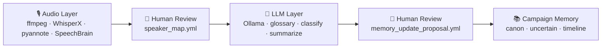
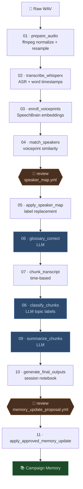
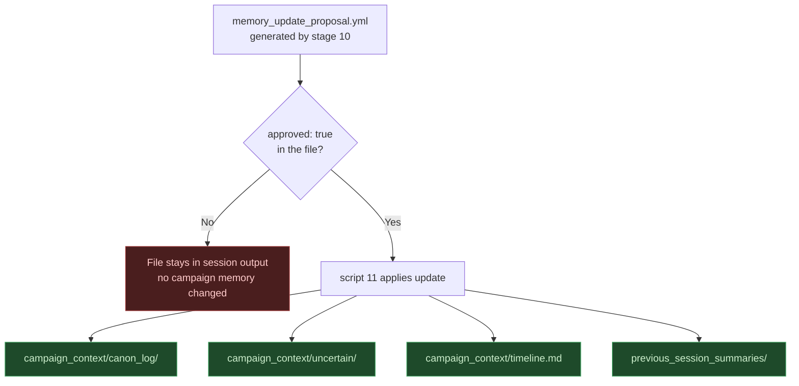
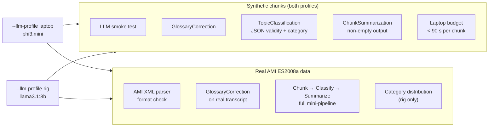

# mentat-session-logger

Local-first RPG session transcriber that turns table audio into speaker-labeled transcripts, campaign notes, and reviewable canon updates.

## What This Project Does

`mentat-session-logger` is a modular local pipeline framework for long tabletop RPG session recordings.

Primary capabilities:

- Process one mixed table microphone track.
- Transcribe Hungarian with occasional English/Hunglish terms.
- Perform diarization and suggest recurring speaker identities with voiceprints.
- Support manual speaker mapping corrections.
- Classify chunks into gameplay/meta/social/logistics/audio categories.
- Generate session notebook outputs and memory update proposals.
- Keep persistent campaign context reviewable and human-approved.

Core rule:

- Audio models handle audio.
- LLMs handle meaning.
- Humans approve identity and canon.



## Local-First Philosophy

This repository is designed for offline-first processing on your own machine.

- No cloud APIs are required by default.
- Optional model downloads are local runtime dependencies.
- Sensitive data (audio, transcripts, voiceprints, campaign notes) is ignored by git by default.

## Suggested Recording Setup

Recommended archival path:

`Jabra Speak 810 + power brick -> USB -> laptop -> WAV recording`

Bluetooth is not recommended for archival capture unless explicitly needed.

## Project Layout

```text
mentat-session-logger/
  configs/
  envs/
    default/
  prompts/
  scripts/
  src/mentat_session_logger/
  tests/
```

The default environment is a template. Real campaign data should live in private environments like `envs/local/`.

## Dependencies

Base:

- Python 3.10+
- `ffmpeg` in PATH (or set `MSL_FFMPEG_BIN` to the full path)
- Python packages declared in `pyproject.toml` (installed automatically with `pip install -e .`)

Install links (clickable):

- Python downloads: [https://www.python.org/downloads/](https://www.python.org/downloads/)
- FFmpeg downloads: [https://ffmpeg.org/download.html](https://ffmpeg.org/download.html)
- Git downloads: [https://git-scm.com/downloads](https://git-scm.com/downloads)

Optional heavy backends for speech recognition and diarization:

```
pip install -e .[asr]
```

This installs `torch`, `whisperx`, and `pyannote.audio`. A Hugging Face token (`HF_TOKEN`) is also required for speaker diarization.

- `speechbrain`
- Local LLM runtime (Ollama-compatible endpoint)

Optional backend links (clickable):

- WhisperX: [https://github.com/m-bain/whisperX](https://github.com/m-bain/whisperX)
- pyannote.audio: [https://github.com/pyannote/pyannote-audio](https://github.com/pyannote/pyannote-audio)
- SpeechBrain: [https://github.com/speechbrain/speechbrain](https://github.com/speechbrain/speechbrain)
- Ollama: [https://ollama.com/download](https://ollama.com/download)

## Install

Install every local dependency step-by-step (click and run).

Windows (PowerShell):

```powershell
# 1) Create and activate virtual environment
python -m venv .venv
.venv\Scripts\Activate.ps1

# 2) Upgrade pip tooling
python -m pip install --upgrade pip setuptools wheel

# 3) Install package + dev tools (pytest, mypy, ruff)
pip install -e .[dev]

# 4) Optional: install ASR/diarization backends
pip install -e .[asr]
```

Linux/macOS:

```bash
# 1) Create and activate virtual environment
python3 -m venv .venv
source .venv/bin/activate

# 2) Upgrade pip tooling
python -m pip install --upgrade pip setuptools wheel

# 3) Install package + dev tools (pytest, mypy, ruff)
pip install -e .[dev]

# 4) Optional: install ASR/diarization backends
pip install -e .[asr]
```

Windows FFmpeg setup options:

```powershell
# Winget option
winget install --id=Gyan.FFmpeg -e

# Chocolatey option
choco install ffmpeg -y
```

Linux FFmpeg setup options:

```bash
# Ubuntu/Debian
sudo apt update && sudo apt install -y ffmpeg

# Fedora
sudo dnf install -y ffmpeg
```

Verify all key dependencies are available:

```bash
python --version
ffmpeg -version
python -m pytest -q
```

## Environment System

Initialize a private environment:

```bash
python -m mentat_session_logger init-env --name local
```

Creates:

```text
envs/local/
  config.yml
  campaign_context/
  voiceprints/
  sessions/
  profiles/
```

Switch environment with `--env`, for example `default`, `local`, `dune_home_campaign`, `test_fixture`.

## Demo Datasets

Recommended pilot data with mixed audio and manual transcript annotations:

- [AMI ES2008a mixed headset WAV](https://groups.inf.ed.ac.uk/ami/AMICorpusMirror/amicorpus/ES2008a/audio/ES2008a.Mix-Headset.wav)
- [AMI manual transcript annotations zip](https://groups.inf.ed.ac.uk/ami/AMICorpusAnnotations/ami_public_manual_1.6.2.zip)

Other multi-speaker corpora (larger):

- [SBCSAE (OpenSLR SLR155)](https://openslr.org/155/)
- [CHiME-6 (OpenSLR SLR150)](https://openslr.org/150/)
- [AMI overview and official portal](https://groups.inf.ed.ac.uk/ami/corpus/)

## Laptop Pilot Quickstart (No LLM)

This path is optimized for your laptop and skips LLM stages.

1. Create local environment folders:

```bash
python -m mentat_session_logger init-env --name local
```

2. Download pilot audio into:

`envs/local/sessions/session_ami_es2008a/input/session_ami_es2008a_raw.wav`

3. Prepare audio:

```bash
python scripts/01_prepare_audio.py --env local --session session_ami_es2008a --input envs/local/sessions/session_ami_es2008a/input/session_ami_es2008a_raw.wav --normalize
```

4. Run no-LLM integrated pipeline:

```bash
python -m mentat_session_logger run --env local --session session_ami_es2008a --pipeline pilot_no_llm
```

5. Inspect outputs under:

`envs/local/sessions/session_ami_es2008a/`

## Laptop Pilot Quickstart (With LLM via Ollama)

This path runs the full pipeline including glossary correction, chunk classification,
summarization, and memory update proposals — all powered by a local LLM.

### 1. Install Ollama

| Platform | Installer |
| -------- | --------- |
| **Windows** | [ollama.com/download/windows](https://ollama.com/download/windows) — installer `.exe`. Or in PowerShell: `winget install Ollama.Ollama` |
| **macOS** | [ollama.com/download/mac](https://ollama.com/download/mac) — installer `.dmg`. Or: `brew install ollama` |
| **Linux** | `curl -fsSL https://ollama.com/install.sh \| sh` |

After installing, verify Ollama is running:

```bash
ollama list
```

#### Docker option

If Ollama is running in Docker instead of being installed directly on the host,
publish the container's port `11434` to localhost so the app can use the same
Ollama-compatible endpoint:

```bash
docker run -d --name ollama -p 11434:11434 -v ollama:/root/.ollama ollama/ollama
```

With an NVIDIA GPU, use Docker's GPU support:

```bash
docker run -d --gpus all --name ollama -p 11434:11434 -v ollama:/root/.ollama ollama/ollama
```

Check the container:

```bash
docker ps
docker exec -it ollama ollama list
```

The default environment config already points at the host-mapped Docker endpoint:

```yaml
llm:
  provider: ollama
  endpoint: http://localhost:11434/api/generate
  model: llama3.1:8b
```

### 2. Pull a model

Choose one based on your hardware. The default config uses `llama3.1:8b`.

| Model | Pull command | VRAM / RAM needed | Notes |
| ----- | ----------- | ----------------- | ----- |
| **llama3.1:8b** (default) | `ollama pull llama3.1:8b` | ~8 GB | Best quality for classification and summaries |
| **mistral:7b** | `ollama pull mistral:7b` | ~6 GB | Fast, good alternative |
| **phi3:mini** | `ollama pull phi3:mini` | ~2 GB | Fastest, fits on any laptop CPU |

Run in your terminal:

```bash
ollama pull llama3.1:8b
```

If Ollama is running in Docker:

```bash
docker exec -it ollama ollama pull llama3.1:8b
```

Confirm the model loaded:

```bash
ollama run llama3.1:8b "Respond with one word: ready"
```

Or through Docker:

```bash
docker exec -it ollama ollama run llama3.1:8b "Respond with one word: ready"
```

If your machine is RAM-constrained, swap the model name in `configs/default.yml`:

```yaml
llm:
  model: phi3:mini          # change this line
  base_url: http://localhost:11434
```

### 3. Install Python dependencies (LLM extras)

```bash
pip install -e ".[dev]"
pip install whisperx pyannote.audio speechbrain
```

> WhisperX and pyannote.audio require a GPU or will run slowly on CPU.
> For a CPU-only pilot, use the No-LLM path for transcription and diarization,
> then re-run only the LLM stages once you have a transcript.
>
> The Ollama Docker container only provides the LLM endpoint used by glossary
> correction, classification, and summarization. Whisper/WhisperX is separate:
> install it in the Python environment as shown above, run the whole app in a
> container that includes WhisperX, or add a separate ASR service/container.

### 4. Create local environment

```bash
python -m mentat_session_logger init-env --name local
```

### 5. Download pilot audio

Place AMI ES2008a mixed headset WAV into:

`envs/local/sessions/session_ami_es2008a/input/session_ami_es2008a_raw.wav`

Direct download link: [ES2008a.Mix-Headset.wav](https://groups.inf.ed.ac.uk/ami/AMICorpusMirror/amicorpus/ES2008a/audio/ES2008a.Mix-Headset.wav)

### 6. Run the full LLM-enabled pipeline

```bash
python -m mentat_session_logger run \
  --env local \
  --session session_ami_es2008a \
  --pipeline default
```

Resume after interruption:

```bash
python -m mentat_session_logger run \
  --env local \
  --session session_ami_es2008a \
  --pipeline default \
  --resume
```

### 7. Review outputs

After the pipeline completes, check:

- `envs/local/sessions/session_ami_es2008a/transcripts/diarized_named_corrected.md` — glossary-corrected, speaker-labeled transcript
- `envs/local/sessions/session_ami_es2008a/classifications/` — per-chunk topic labels
- `envs/local/sessions/session_ami_es2008a/chunk_summaries/` — per-chunk summaries
- `envs/local/sessions/session_ami_es2008a/final/` — session notebook
- `envs/local/sessions/session_ami_es2008a/final/memory_update_proposal.yml` — **review and set `approved: true` before applying**

Apply approved memory update:

```bash
python scripts/11_apply_approved_memory_update.py --env local --session session_ami_es2008a
```

> **Note on clickable run links:** Standard Markdown links cannot execute shell commands.
> Copy the commands above into your terminal. In VS Code, you can open an integrated
> terminal with `` Ctrl+` `` and paste directly.

---

## End-to-End Example



> Stages 06, 08, 09 require Ollama. All other stages run without an LLM.
> The `pilot_no_llm` pipeline skips the blue stages and both human review gates after speaker mapping.

1. Initialize private env:

```bash
python -m mentat_session_logger init-env --name local
```

2. Put raw audio here:

`envs/local/sessions/session_012/input/session_012_raw.wav`

3. Prepare audio:

```bash
python scripts/01_prepare_audio.py --env local --session session_012 --input envs/local/sessions/session_012/input/session_012_raw.wav --normalize
```

4. Transcribe:

```bash
python scripts/02_transcribe_whisperx.py --env local --session session_012 --audio envs/local/sessions/session_012/audio/session_012_16k.wav --language hu --min-speakers 4 --max-speakers 8
```

5. Enroll voiceprints:

```bash
python scripts/03_enroll_voiceprints.py --env local
```

6. Match speakers:

```bash
python scripts/04_match_speakers.py --env local --session session_012
```

7. Review/create:

`envs/local/sessions/session_012/maps/speaker_map.yml`

8. Apply map:

```bash
python scripts/05_apply_speaker_map.py --env local --session session_012
```

9. Correct glossary:

```bash
python scripts/06_glossary_correct.py --env local --session session_012
```

10. Chunk:

```bash
python scripts/07_chunk_transcript.py --env local --session session_012
```

11. Classify:

```bash
python scripts/08_classify_chunks.py --env local --session session_012
```

12. Summarize:

```bash
python scripts/09_summarize_chunks.py --env local --session session_012
```

13. Final outputs:

```bash
python scripts/10_generate_final_outputs.py --env local --session session_012
```

14. Review memory proposal manually.

15. Apply approved memory update:

```bash
python scripts/11_apply_approved_memory_update.py --env local --session session_012
```

## One-Command Runner

```bash
python -m mentat_session_logger run --env local --session session_012 --pipeline default
```

Resume from successful stage manifests:

```bash
python -m mentat_session_logger run --env local --session session_012 --pipeline default --resume
```

## Output Artifacts

Session outputs are written under:

`envs/<env>/sessions/<session>/`

Including:

- `audio/`
- `raw/`
- `maps/`
- `transcripts/`
- `chunks/`
- `classifications/`
- `chunk_summaries/`
- `final/`
- `manifests/`

Each stage writes a manifest JSON with status, timestamps, inputs, outputs, and error details on failure.

## Memory Review Policy

`memory_update_proposal.yml` is generated in session outputs and must be reviewed.

- Canon is never silently updated.
- `scripts/11_apply_approved_memory_update.py` requires `approved: true`.
- Uncertain facts should remain in uncertain logs unless explicitly approved.



## Quality Commands

```bash
pytest
ruff check .
ruff format .
mypy src
```

## Local E2E Testing Modes

Use both of these locally:

1. Fast mocked E2E (no Ollama / WhisperX / torch required):

```bash
pytest tests/unit/test_local_e2e_pipeline_with_mocks.py -q
```

2. Real dependency-backed integration/E2E:

```bash
pytest tests/integration/ -m integration --llm-profile laptop -v
```

## Integration Tests (LLM via Ollama)

Integration tests exercise the LLM pipeline stages against both synthetic chunks and real
AMI Corpus transcript data. They **auto-skip** if Ollama is not running or the required
model has not been pulled.

### Prerequisites

1. Install and start Ollama (see [Laptop Pilot Quickstart (With LLM via Ollama)](#laptop-pilot-quickstart-with-llm-via-ollama)).
2. Pull the model for your hardware:

```bash
# Laptop
ollama pull phi3:mini

# Full rig
ollama pull llama3.1:8b
```

3. Download AMI pilot data (required for real-data tests):

`envs/local/sessions/session_ami_es2008a/raw/ami_public_manual_1.6.2/words/`

See [Demo Datasets](#demo-datasets) for the download link.

### Run on a laptop (`phi3:mini`)

```bash
# Synthetic chunks only
pytest tests/integration/ -m integration -v

# Synthetic + AMI real-data tests (5 minutes of meeting audio)
pytest tests/integration/ -m integration -v --llm-profile laptop
```

### Run on a full rig (`llama3.1:8b`)

```bash
# All integration tests including 10-minute AMI window and quality assertions
pytest tests/integration/ -m integration --llm-profile rig -v
```

### Skip integration tests in normal CI

```bash
pytest tests/unit/
# or
pytest -m "not integration"
```

### What gets tested



## Adding a New Pipeline Stage

1. Implement a stage class with `name` and `run(context, artifacts)`.
2. Register it in the CLI stage registry.
3. Add it to `configs/pipelines/default.yml`.
4. Add unit tests with fakes/mocks.

## Swapping Backends

Backends are isolated behind interfaces/protocols:

- ASR: `AsrBackend`
- Speaker embeddings: `SpeakerEmbeddingBackend`
- LLM: `LlmClient`

Replace concrete implementations in one place without rewriting pipeline logic.

## Known Limitations

- One mixed microphone cannot perfectly separate overlapping speech.
- Diarization can confuse speakers, especially with crosstalk.
- GM NPC voices may be split into separate artificial speakers.
- Voiceprints can identify players, not fictional characters.
- Character attribution requires transcript cues and manual review.
- LLM summaries can hallucinate; canon updates must be reviewed.
- Hungarian/Hunglish transcription may need glossary correction.

## Privacy and Safety

Voiceprints, transcripts, and campaign notes may contain sensitive personal data.

- Keep real data in private environments (`envs/local`, etc.).
- Review `.gitignore` before committing.
- Do not upload private artifacts.

## Default Environment Template

`envs/default` is intentionally commit-safe template data, not your real campaign.
